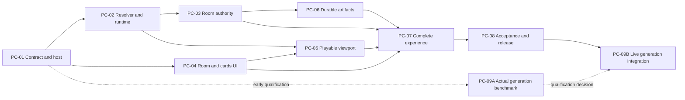

# Competitive Forge delivery plan

## 15 September 2026 — experimental generation in existing rooms

The user requested an MVP on the deployed Chaotic Forge multiplayer UI: dynamically attempt generation for authenticated admin/BYOK hosts, research unclear mechanics, scope rules and winner criteria, and show shared live activity. The local PC-09 supplement starts from production `f151999`; see [scope, limits and qualification](docs/implementation/room-generation-mvp.md). Generated output is currently an isolated shared playtest with local scores. Live API qualification and authoritative generated-game rounds remain incomplete; the existing competitive builder stays available explicitly.

## Latest user decision — pixel instruction demo (13 September 2026)

This decision supersedes the fixed Kitchen demo and exactly-three-player defaults below for new pixel rooms. Two players can create and start; a third is optional, with a hard cap of three. Each connected player confirms one custom instruction card, optionally filled from a starter. The host explicitly asks Forge to mesh them into a single bounded pixel game. The model returns executable rule configuration for the retained Snake/Invaders/Bounce engine, including scoring weights and an interpretation for each card. It does not generate arbitrary JavaScript or satisfy all of PC-09.

Players run concurrently in separate arenas with matching rules, seed and server start time. Highest points wins, with fewer hits as the next comparison. Existing room capabilities, captured inputs, server replay, results and archive contracts are reused. Winner and loser may each propose a further instruction while the bounded recipe has space. Source text, model interpretation and user confirmation stay distinct. Legacy Kitchen and G1–G4 remain retained.

User authorized implementation and GPT Sites deployment on the PC-05 stack; broad edge-case suites remain paused, with one real local golden flow requested. Full QUALITY.md gates and independent acceptance remain required before merging. See [current handoff](docs/design/pc-05-handoff.md).

**Updated:** 2026-09-13
**Status:** Product planning; GitHub publication in progress. PC-01 is [issue #30](https://github.com/ghostleek/chaotic-forge/issues/30), assigned to Lance (@Leoendithas). PC-02–11 remain drafts pending publication after the main-branch sync. Implementation has not started.
**Specification:** [PRD.md](./PRD.md)
**Preserved prior plan:** [Mechanic-lab v0.2](./archive/2026-09-13-mechanic-lab/PLAN-v0.2-mechanic-lab.md)

## Product outcome and scope

Friends choose game-concept cards, play the resulting game, and change it through the competition itself. After the first round, the winner and loser each receive one opportunity to add a mechanic. Everyone plays the next version. The group chooses when to end and can save the last played game for future play or remix.

The target product generates playable mashups from the chosen concepts. The first demonstration uses clearly identified authored combinations through the same versioned build-manifest interface. Eight preset combinations do not fulfill the live-generation milestone. PC-09 is required for the broader target. Its qualification starts after PC-01 in parallel with early demo work; product integration follows the accepted core baseline. PC-10 and PC-11 remain separate optional work.

Proposed first-demo defaults are exactly three people, each in their own desktop browser, with keyboard/mouse controls and separate matched 60-second trials in one synchronized room. The later target supports three to six people. Each participant selects one variant in a visible concept slot: FPS, Zombies, or Cooking. Two authored variants per slot produce eight supported initial combinations. Subsequent eligible additions use the bounded Dinnerbell, Hot Potato, and Zombie Pantry cards. Pass remains available at a cap so a finite deck never silently ends the session.

Both extrema receive one card opportunity. Their order alternates by round. Ties allocate two distinct slots by a documented deterministic rotation; a DNF does not earn a slot. The active roster freezes for a round. Stored trusted time governs a disclosed 30-second host-absence grace and deterministic succession by remaining roster order. Host status grants no edit right. After an absent editor's grace, the remaining group may explicitly abort unplayed evolution, preserve the last completed build, and wait for a valid three-person roster at a round boundary or archive; it cannot transfer that edit right or start a two-player demo trial. The group can unanimously end at results before edits; the saved artifact is the last actually played build. For a saved remix, the proposed new-match setup lets each new player keep or replace an inherited initial concept slot while retaining inherited later cards. Replacements become new fork decisions; unchanged choices are Play again. These defaults must agree with the PRD before contract acceptance.

## Contracts that survive the pivot

The existing G1–G4 Returnal journey remains a regression surface. Its one-rule A/B contract and provenance labels remain valid for that lab. Competitive rounds accumulate mechanics and do not claim causal experiment evidence. Gameplay scores are actual local trial outcomes submitted to the room authority; fixture results and authored demo recipes must retain their real provenance.

A build manifest binds selected cards, resolved rules, assets, controls, seed policy, scoring version, resolver version, and executable runtime version. Room commands, run inputs/results, and saved artifacts consume that same contract. Failed resolution preserves the last known playable build. Saved-game play never silently regenerates a different recipe or swaps in a newer incompatible runtime.

Source references, Forge interpretation, participant decisions, and preset/live-generation origin remain distinguishable. No runtime model claim is permitted without an actual verified call. The first demo introduces no broad source-corpus expansion, generic editor, user accounts, or arbitrary same-origin executable code.

## Two people and shared ownership

| Person | Accountable scope | Independent reviewer |
| --- | --- | --- |
| Lance | Domain contracts, recipe resolution, simulation/scoring, room authority, D1, archives, later generation | Kahhow |
| Kahhow | Lobby/cards, player lifecycle UI, first-person rendering/input, assets, complete experience | Lance |

The user confirmed Kahhow (@ghostleek) and Lance (@Leoendithas) and requested GitHub assignments. PC-01 is published and assigned; see the [publication index](./docs/issues/README.md) for the remaining drafts. An agent may implement within a person's packet, but that person remains accountable and accepts the result. If the named reviewer materially coauthors the diff, use another independent reviewer for the final review requirement.

Lance owns `package.json`, lockfile, build/test configuration, hosting manifest, database schema/migrations, shared contract, and versioned runtime interfaces. Kahhow owns the party route composition and scoped styles. Shared-file changes require an explicit handoff and one owner; neither stack edits a shared barrel or global stylesheet casually. Each issue lists its allowed files.

## Core demo packets

| Packet | Outcome | Owner | Hard dependencies | Implementation estimate |
| --- | --- | --- | --- | --- |
| [PC-01](./docs/issues/PC-01.md) | Shared protocol and verified Worker/D1 foundation | Lance | Selected clean baseline | 8–12 h |
| [PC-02](./docs/issues/PC-02.md) | Typed manifest resolver and executable FPS/zombie/cooking demo | Lance | PC-01 | 24–40 h |
| [PC-03](./docs/issues/PC-03.md) | Authoritative online rooms and competition lifecycle | Lance | PC-01, PC-02 | 16–24 h |
| [PC-04](./docs/issues/PC-04.md) | Room client, lobby, and visible concept-card choices | Kahhow | PC-01 | 8–12 h |
| [PC-05](./docs/issues/PC-05.md) | First-person playable viewport, actual aiming, and input capture | Kahhow | PC-02, PC-04 | 12–20 h |
| [PC-06](./docs/issues/PC-06.md) | Durable immutable saves, future play, and remix | Lance | PC-01, PC-02, PC-03 | 8–12 h |
| [PC-07](./docs/issues/PC-07.md) | Complete three-browser product journey | Kahhow | PC-03, PC-04, PC-05, PC-06 | 8–16 h |
| [PC-08](./docs/issues/PC-08.md) | Independent acceptance and release candidate | Lance | PC-07 | 8–12 h |

The useful parallel period is Lance implementing rules/rooms while Kahhow builds against the accepted protocol. The runtime interface must land before playable rendering can be accepted; the room and archive must work before the complete journey can be accepted. Fixtures enable independent development but are test-only and never replace those integration dependencies.

## Stacked branches and serialized merges

The user explicitly requested mostly independent stacked PRs. This authorizes an exception to the prior sequential-branch policy for this series. Merges remain serialized and every merged result receives the full quality gate.

The inspected planning baseline is `c39ddb8a7b428585e2ab0e6c59fe0b670c2803c7`. It is not a dispatch-ready base: the checkout contains uncommitted planning, guidance, and imported reference files. Before implementation, reconcile those files deliberately and record the accepted complete base SHA and actual parent PR links in each issue. PC IDs are local packet IDs, not GitHub issue numbers.

Use `codex/pc-XX-description` branches. A child may branch from its explicitly accepted parent head; record that exact SHA and review the child's incremental diff. Do not use an implicit moving branch tip, invent a parent link, or cherry-pick another lane's unaccepted work. Cross-lane interfaces require the accepted shared commit. After a parent merges, rebase its children onto accepted main, reconcile the combined diff, and rerun the relevant gates. No two PRs merge concurrently.

One permitted sequence is PC-01 → PC-02 → PC-04 → PC-03 → PC-05 → PC-06 → PC-07 → PC-08. Independent ready packets may exchange order when all hard dependencies are satisfied. The graph, not priority labels or available tokens, controls dependency closure.

## Host proof and quality

The current Site already uses Vinext/Cloudflare configuration, but npm build/dev and browser tests currently run Next. PC-01 must resolve this mismatch explicitly. The Sites build helper invokes the configured build script; it cannot manufacture a Worker from a Next-only build. D1 is currently undeclared. Use logical `DB`, `db/schema.ts`, generated `drizzle/**` migrations, raw prepared statements, and a narrow server binding helper. R2 is unnecessary for compact preset records; consider it only when later dynamic artifacts require blob storage.

Prove the built Worker entrypoint, local D1 migration path, concurrent revision checks, restart durability, and a production-equivalent browser test harness. Preserve all golden-flow tests. Verify participant audience access before claiming a publicly joinable room; a private Site can require platform sign-in. Never use a memory/localStorage fallback as durable or multi-browser proof.

Every implementation PR must run the exact [QUALITY.md](./QUALITY.md) gates:

1. `npm run lint`
2. `npm run build`
3. `npm test`
4. Independent adversarial review of the complete diff
5. A second lint, build, and focused-test run after review fixes

PC-01 introduces and documents the additional built-Worker/D1 commands and target-specific suite. Until they exist, their checks are planned rather than runnable npm claims. Network/storage packets must run that suite; UI packets additionally verify real browser behavior; PC-08 exercises three separate participants against the actual host. Screenshots, old merged commits, imported harness results, and mocked transport are not fresh quality passes.

## Timeboxes, cuts, and later work

The eight core packets total 92–148 implementation hours. Reserve another 24–40 person-hours for cross-review, full gates, fixes, and integration: 116–188 person-hours overall, roughly 15–24 person-days. With two people and the serial runtime/room chain, allow roughly 8–15 working days. These are planning ranges, not commitments; re-estimate after PC-01 and PC-02. Each packet stops at its timebox to reduce scope or revise the estimate, never to waive its gates.

Preserve a coherent demo if scope shrinks: three own-browser participants, one real FPS/zombie/cooking mashup, honest card effects, both extrema changing it, another played round, group end, durable save, and future play/remix. Cut optional art, extra variants, presentation polish, and additional families first. Reducing the declared eight-combination deck requires a visible PRD/deck revision. If hosting is unavailable, continue independent work but keep online acceptance blocked; hotseat is not an equivalent completion. If no later card is available, Pass preserves the loop. Never save an unplayed failed build as the group's finished game.

| Later packet | Role in direction | Exit evidence |
| --- | --- | --- |
| [PC-09](./docs/issues/PC-09.md) | Required target: qualify after PC-01; integrate after accepted PC-02/03/05/06/07/08 | Actual generation of an initial build plus two additive remixes outside the authored list, retained prior contributions, bounded latency/cost, isolated execution, immutable playable artifacts |
| [PC-10](./docs/issues/PC-10.md) | Optional AR/hand-sign jump-quest feasibility | Real gesture input, explicit camera/AR limits, accessible fallback, measured compatibility |
| [PC-11](./docs/issues/PC-11.md) | Adaptive-difficulty idea retained for later evaluation | Visible fair rules, preserved edit rights, tested score comparability and sandbagging risks |

PC-09 cannot be marked fulfilled by PC-01–08. A pending capability, unsupported API, or failed generation job must remain explicit. See the [capability assessment](./docs/openai-capability-fit.md) before selecting any live integration. PC-10/11 are not dependencies of the core demo or permission to broaden it.

## Planning validation

This change authors a PRD delivery plan and issue specifications. GitHub publication status is recorded in the issue index. It does not implement the party game, provision, deploy, or report a fresh runtime quality pass. The previous plan is preserved byte-for-byte in the dated archive. Its historical relative-link base and path mappings are recorded in the archive README and manifest.

## Latest decision — authenticated API access and saved permutations (13 September 2026)

Paid generation requires BYOK unless ChatGPT-authenticated email is exactly kahhow@string.sg, leekahhow@gmail.com or lancetyw@gmail.com (case-normalized). Those admins may use the site key. This supersedes broader sponsored trials. Public saved-demo play makes no API call. Never accept client-provided identity as authorization.

Current party creation uses GPT-6 Astra Responses structured rules; separate Agents code creation stays disabled until a supervised runner is qualified. Exact Snake/Invaders two- and three-player permutations reuse saved output; custom modifiers do not silently match. Starter buttons prefill with visible help and require confirmation. Preserve provenance and deterministic replay.

Implementation/release packet: PC-09 supplement on current production base d766b394958dd6518d664b04e5f41cd00a2bca9f, preserving existing PC-03/05/06 runtime and migrations. Human owners Kahhow (UX) and Lance (backend/shared files); implementer Codex; independent review required. Allowed files: creator/auth routes, generation funding/resolver, starter UI, appended schema migration, focused tests, this guidance and mini PRD. No new GitHub issue/PR verified. Existing source dependencies remain; Agents runner is optional/disabled fallback. Run QUALITY.md gates and real Worker tests before release. Timebox: this deployment session; cut is public saved play plus protected Responses generation, with Agents disabled. Roll back Site version without dropping stored data.

## PC-09 correction — public saved Snake remix (14 September 2026)

User reported `/play/snake-space-invaders` was showing the wrong authored game. Restore the existing retained `Snake Invaders: Eat 10, Blast 25` recipe through `cachedInstructionDemo` and the existing three-life pixel runtime/renderer. Standalone practice uses seed 73, local controls and no API usage; no new players or room records are created. Preserve current production Dino work from exact base `b03246e`.

Owner: Kahhow (route/player UX); shared backend owner: Lance; implementer: Codex; independent reviewer: review_creation. Allowed files are the public Snake route/player, saved-demo adapter/seed, demo metadata, focused behavioral tests and this documentation. Preserve auth/BYOK, room/archive contracts, runtime bytes and stored data. No new issue or PR verified. Selected skills: Sites building/hosting, Next.js boundary guidance, React checks. Gates: QUALITY lint, build, full tests, independent review and post-review focused verification. Timebox: this correction session. Rollback: previous Site version without deleting data.
