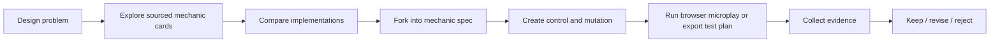

# Mechanic Forge

Mechanic Forge is an evidence-oriented workspace for game-mechanic design.

Instead of starting from a blank graph or a generic AI prompt, it starts with a design problem, shows sourced examples from real games, helps the designer compare trade-offs, then guides them toward a small testable decision.

**Current repository status:** alpha Explore-first prototype with a ten-card validation corpus.  
**Full docs:** [PRD.md](./PRD.md) · [PLAN.md](./PLAN.md) · [QUALITY.md](./QUALITY.md)

## Mini PRD

### Product in one sentence

Help a designer find proven mechanic patterns, adapt one to their game, and validate the smallest credible change before committing production time.

### Who it is for

- Solo developers
- Hands-on game designers
- Small PC/console teams
- Design leads reviewing mechanic proposals

### Problem

Today, mechanic design work is fragmented across references, docs, prototypes, spreadsheets, playtests, and generic AI output. The handoff between “interesting idea” and “defensible design decision” is slow and error-prone.

### Core promise

> Find proven gameplay patterns, understand why they work, forge a version for your game, and run the smallest credible test before committing production time.

### Initial wedge

Start with combat and mobility mechanics in action games and roguelites, where the product can combine:

1. behavior-first search,
2. sourced implementation cards,
3. structured comparison,
4. forked mechanic specifications,
5. constrained browser microplays,
6. evidence-backed keep/revise/reject decisions.

### Non-goals for the first release

- Full game generation
- A general-purpose node editor
- Broad genre coverage
- Public social/community features
- Predictive simulation without executable rules

## Architecture at a glance



### Current repository shape

```text
Next.js app
  app/page.tsx
    -> components/explore-shell.tsx
       -> lib/mechanics/corpus.ts
       -> lib/mechanics/explore-state.ts
       -> lib/mechanics/query.ts
       -> lib/mechanics/schema.ts

Tests
  tests/mechanics.test.mjs
  tests/browser/

Product docs
  PRD.md
  PLAN.md
  QUALITY.md
```

The current app is intentionally focused on the Explore-first wedge: a searchable, filterable ten-card mechanic corpus with visible provenance and comparison metadata.

## What is already done

The repository has already completed the planned early slices:

- PR 1: quality baseline
- PR 2: product specification and delivery plan
- PR 3: schema, test harness, and ten-card validation corpus
- PR 4: Explore-first application shell and behavior search

The project is currently paused at **Checkpoint A** before corpus expansion.

## Next PRs to do

These are the next planned implementation PRs after Checkpoint A passes:

1. **PR 5 — Production corpus expansion**  
   Grow beyond the ten-card validation set into a broader sourced corpus for the validated vertical.
2. **PR 6 — Mechanic/game detail and structured Compare**  
   Add canonical detail pages and side-by-side comparison flows.
3. **PR 7 — Forge specification, control/mutation diff, and exports**  
   Let users fork a mechanic into an owned spec and export Markdown, JSON, and test-plan artifacts.
4. **PR 8 — Creator auth and durable experiment storage**  
   Add ownership, persistence, and secure experiment management.
5. **PR 9 — Dash microplay creator preview**  
   Reintroduce the dash arena as a constrained validation template.
6. **PR 10 — Unlisted sharing and blind tester flow**  
   Enable no-account reviewer playtests with controlled variant assignment.
7. **PR 11 — Evidence report and decision log**  
   Close the loop with structured results and recorded decisions.

## Open issues / questions

The main unresolved product questions are:

1. Do target users search most naturally by behavior, mechanic name, or reference game?
2. Which narrow vertical is strongest first: action combat, roguelite progression, or another adjacent slice?
3. Does structured comparison create enough value over generic AI summaries to trigger a fork?
4. After Forge, what artifact is most valuable: test plan, browser microplay, or engine-ready handoff?
5. Will testers complete a blind two-variant microplay without creator facilitation?
6. What minimum source evidence and privacy controls are required for professional trust?

## Local development

```bash
npm install
npm run dev
```

Available scripts:

- `npm run lint`
- `npm run build`
- `npm test`

