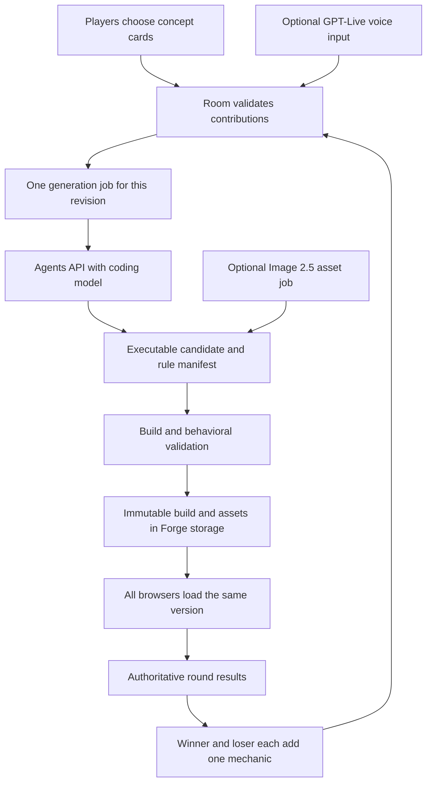

# OpenAI capability fit for Forge

**Reviewed:** 13 September 2026 · **Scope:** Official release notes and API documentation; no live API experiment, model benchmark, installation or deployment performed.
**Related:** [PRD](../PRD.md) · [delivery plan](../PLAN.md) · [generation packet PC-09](./issues/PC-09.md)

## Recommendation

Use **Agents API as the candidate game-construction service**, with a coding model such as GPT-6 Astra. Use **GPT-Image-2.5 Flare** for timely new art and **Sunburst** where precise edits to an existing visual matter. **GPT-Live 1** can be the optional voice host that hears ideas and explains progress while the backend works. It does not generate the executable game or track hand signs by itself.

This is a fit assessment from capabilities, not proof of playable quality or acceptable waiting time. The game runtime, room permissions, scoring, validation and final artifact storage remain Forge responsibilities.

## What the releases actually add

| Capability | Release / documented behavior | Best fit in this product |
| --- | --- | --- |
| Agents API | Public beta released **10 September 2026**. Managed Codex harness with durable sessions, orchestration, compaction and recovery. | Build the initial mashup and evolve it after the two eligible additions. |
| GPT-Live 1 (`gpt-live-1`) | Generally available **10 September 2026**. Full-duplex conversation with reasoning/tool work delegated to a backend. | Spoken card suggestions, rule explanation, progress and reactions. |
| GPT-Image-2.5 Sunburst / Flare | Released **8 September 2026**, through Image API and the Responses image tool; both add `xhigh` and `max` quality. | Game-card art, textures, backgrounds, sprites and visual changes. |

Dates and release scope: [OpenAI API changelog](https://developers.openai.com/api/docs/changelog).

### Agents API: strongest fit for creating executable games

The API can run commands, edit files and produce artifacts in a sandbox. Durable sessions can receive subsequent tasks. That supports a construction loop which builds, tests and repairs an output, rather than returning an idea alone. GPT-6 Astra appears in the official quickstart as the agent model. [Agents API overview](https://developers.openai.com/api/docs/guides/agents-api/overview), [quickstart](https://developers.openai.com/api/docs/guides/agents-api/quickstart).

The **Agents API** is a managed harness; the **Agents SDK** runs the agent loop inside your own application; **Responses** is the lower-level model API. For a small JSON specification interpreted by an existing engine, Responses plus Structured Outputs may be simpler. The user's on-the-fly mashups are a stronger reason to evaluate the managed code/build/test workflow. Schema conformance alone does not establish executable correctness or fun. [Official agent comparison](https://developers.openai.com/api/docs/guides/agents), [Structured Outputs](https://developers.openai.com/api/docs/guides/structured-outputs).

Hosted sandboxes provide Linux with Node/Python and configurable files, packages and setup. Browser and graphics tests must still be qualified in the actual environment. The documentation does not establish turnkey multiplayer game hosting or deployment for Forge. [Hosted sandboxes](https://developers.openai.com/api/docs/guides/agents-api/environments/openai-hosted), [architecture](https://developers.openai.com/api/docs/guides/agents-api/architecture).

### GPT-Live 1: conversation around the work

Live supports text and audio, but **not image or video input**. It is not the hand-recognition component for the AR idea. Voice sessions cost **$0.05/minute**, billed per second; backend model/tool costs are separate. A ten-minute session therefore adds $0.50 in voice usage before backend work. [GPT-Live 1 model](https://developers.openai.com/api/docs/models/gpt-live-1).

For a later voice interface, client delegation is the relevant candidate: Forge can send validated job progress/results from its own generation service to Live. The app owns permissions and durable state. Interrupting speech does not cancel the generation job automatically. Voice should propose cards through the same eligibility checks as clicks; it must not bypass winner/loser permissions. [Getting started with GPT-Live](https://developers.openai.com/api/docs/guides/live), [delegation and tools](https://developers.openai.com/api/docs/guides/live-delegation).

### GPT-Image-2.5: assets, not mechanics

The exact model IDs are `gpt-image-2.5-sunburst` and `gpt-image-2.5-flare`; “gpt-image2.5” is the family shorthand, not either documented ID. Sunburst emphasizes editing precision; Flare emphasizes faster everyday generation. Both output images, not game code, collision logic, 3D meshes or a hand-tracking system. [Sunburst](https://developers.openai.com/api/docs/models/gpt-image-2.5-sunburst), [Flare](https://developers.openai.com/api/docs/models/gpt-image-2.5-flare).

Transparent PNG/WebP outputs are supported. The guide warns that complex prompts may take up to two minutes and recurring visual consistency can vary. Generate/cache the demo assets in advance, or use placeholder art until a complete asset version is ready; never change collision-critical visuals halfway through a round. More expensive quality settings should not be the default for every card. [Image generation guide](https://developers.openai.com/api/docs/guides/image-generation).

## Proposed runtime architecture

These boundaries are proposed application design:

1. Freeze the exact card set, parent build, input capabilities and rule/scoring constraints. Submit both later additions together after both slots are resolved.
2. Supply a small runtime scaffold and permitted dependencies. Ask for executable effects, a rule manifest, controls, source, build output and behavioral checks.
3. Validate outside the agent's self-reported success. Require behavioral checks and witness traces for retained/new contributions plus a completing run; distinguish those tested scenarios from a universal correctness proof. Verify score traces and reject unsupported permissions/dependencies.
4. Promote one immutable artifact atomically. Old or canceled job results cannot replace the room's current version. Distribute the same build to every participant.
5. Execute gameplay without model calls in the frame loop. Generated code is isolated from the parent application's credentials, room authority and storage. Score validation also executes in a bounded environment, not as unrestricted code inside the room Worker.
6. On failure, retain the last accepted game and pending edits. Offer a visible retry/revision or a clearly labeled preset fallback.

## Saving and replay

OpenAI-hosted outputs under `/workspace/outputs` become immutable artifacts when a turn completes. A ZIP can contain a complete build. Published artifacts survive sandbox expiry, but needed files should be downloaded before deleting the agent session. [Files and artifacts](https://developers.openai.com/api/docs/guides/agents-api/environments/files).

Therefore Forge should archive the accepted executable bundle, manifest, assets and lineage in its own durable storage. **Replay loads that output. Remix creates a new output.** A saved prompt, agent session ID or regeneration request is insufficient. Persist the preset runtime versions too, so demo saves remain playable after a later deployment.

## Qualification before making it a live feature

[PC-09](./issues/PC-09.md) is a required later stage for the generated-game promise, not a claim that PC-01–08 presets already satisfy it. Benchmark an initial kitchen mashup and at least two successive additive remixes, including a concept combination outside the authored preset list. Keep voice, camera and fresh art out of this first generation benchmark so results isolate the construction workflow.

Record time to playable artifact, first-pass/after-repair validity, retained contributions, game completion, total model/tool/sandbox cost, retries, and behavior after cancellation or an obsolete revision. Establish a per-job time/spend cap before live evaluation. Choose the release threshold from measured results and party playtests; no release note promises instantaneous games.

Model usage, tools and sandbox compute are separate cost components. Project permissions and model access must be verified; public documentation is not evidence that this account has working access. The quickstart requires agent read/write and Responses write permissions and keeps the application key outside the sandbox. No credentials were inspected for this review. [Agents API pricing](https://developers.openai.com/api/docs/guides/agents-api/overview), [access prerequisites](https://developers.openai.com/api/docs/guides/agents-api/quickstart).

For the demo, use the disclosed authored Kitchen Chaos recipes and retained assets. For the target product, qualify actual Agents API generation behind the same artifact contract. Keep hand-sign recognition as PC-10; Live's voice support does not remove that dependency.
